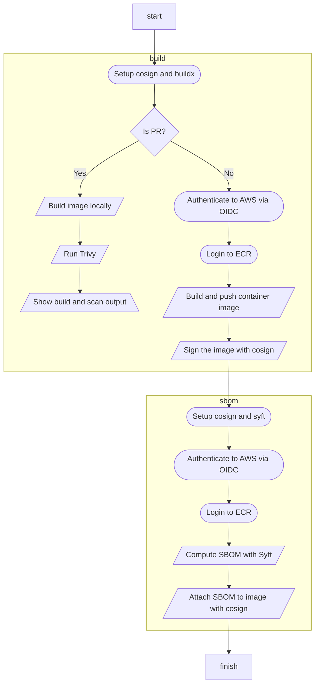
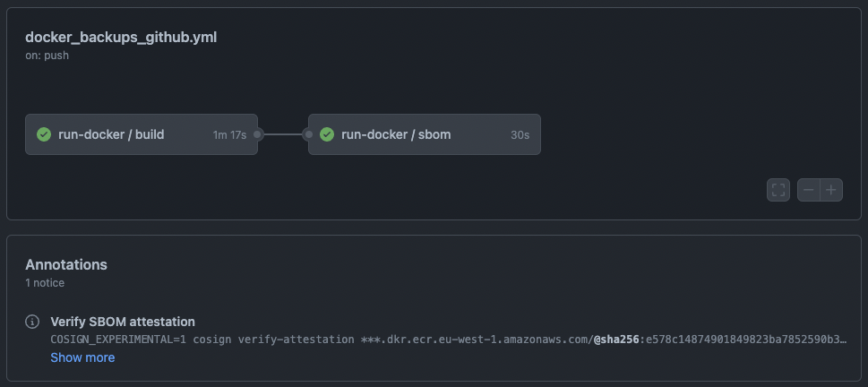

# Build, sign, and compute the SBOM of a container image

A **reusable** Github Action **workflow** that:
  1. Builds a container image
  2. Scans it with `Trivy`
  3. Pushes it to ECR
  4. Signs it with `cosign`
  5. Computes its SBOM with `Syft`
  6. Attaches the SBOM to it via `cosign`






## Usage

1. Setup OIDC between Github and AWS
  > You can use my [Identity Federation for CI on AWS](https://github.com/marco-lancini/utils/tree/main/terraform/aws-oidc-ci)
  > Terraform module to automate the setup of OIDC federation between AWS and Github Actions/Gitlab CI
2. Make a copy of the reusable workflow: [`reusable-docker.yml`](reusable-docker.yml)
3. Call the reusable workflow as shown in the [`sample`](sample.yml)

  ```yaml
  ...
    uses: marco-lancini/utils/ci/github/docker-build-sign-sbom/reusable-docker.yml@main
    with:
      FOLDER: 'path/to/dockerfile/folder'
      AWS_ACCOUNT_NAME: ''
      AWS_ACCOUNT_ID: ''
      AWS_REGION: ''
      AWS_ROLE: ''
      REGISTRY: <id>.dkr.ecr.<region>.amazonaws.com
      IMAGE_NAME: sample-app
  ```


## References

* [CloudSecDocs - SLSA](https://cloudsecdocs.com/devops/pipelines/supply_chain/slsa/)
* [CloudSecDocs - Sigstore](https://cloudsecdocs.com/devops/pipelines/supply_chain/sigstore/)
