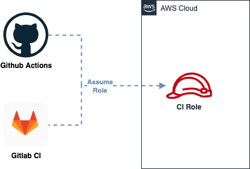

# Identity Federation for CI on AWS


This module automates the setup of OIDC federation between AWS and:
* Github Actions
* Gitlab CI


<p align="center">
  
</p>


## Examples

### Github

```terraform
module "ci_oidc" {
  source = "./aws-oidc-ci"

  allow_github = true
  github_org   = "<org_name>"
  github_repos = [
      "<repo2_name>:*",
      # To restrict to a branch,
      # replace `*` with `ref_type:branch:ref:main`
      "<repo1_name>:ref_type:branch:ref:main",
  ]
}
```

### Gitlab

```terraform
module "ci_oidc" {
  source = "./aws-oidc-ci"

  allow_gitlab = true
  gitlab_repos = [
      "project_path:mygroup/*:ref_type:branch:ref:main"
  ]
}
```


## References

### Github

* [Secure deployments with OpenID Connect & GitHub Actions](https://github.blog/2021-11-23-secure-deployments-openid-connect-github-actions-generally-available/)
* [About security hardening with OpenID Connect](https://docs.github.com/en/actions/deployment/security-hardening-your-deployments/about-security-hardening-with-openid-connect)
* [Identity Federation for GitHub Actions on AWS](https://scalesec.com/blog/identity-federation-for-github-actions-on-aws/)
* [Enabling keyless authentication from GitHub Actions](https://cloud.google.com/blog/products/identity-security/enabling-keyless-authentication-from-github-actions)

### Gitlab

* [Configure OpenID Connect in AWS to retrieve temporary credentials](https://docs.gitlab.com/ee/ci/cloud_services/aws/)
* [Configure OpenID Connect between GitLab and AWS (Terraform example)](https://gitlab.com/guided-explorations/aws/configure-openid-connect-in-aws)
