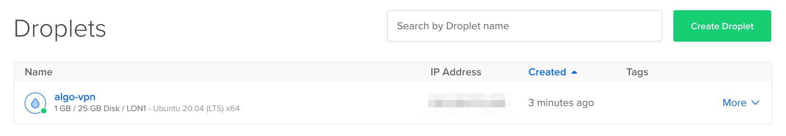

# Terraform for Algo VPN on DigitalOcean

Terraform module which spins up a DigitalOcean droplet hosting an [Algo](https://github.com/trailofbits/algo) VPN server, created as an experiment while starting to trial DigitalOcean.


## Usage

1. Fill secret variables and rename the `tfvars` file: `$ mv sample.tfvars secret.tfvars`
2. Initialize Terraform: `$ terraform init`
3. Deploy the Droplet with Terraform: `$ tf apply -var-file="secret.tfvars"`



1. Connect to the Droplet: `$ ssh root@$(terraform output droplet_ipv4)`
2. Configure Algo: `# vim algo/config.cfg`
```yaml
users:
- <your_username>
unattended_reboot:
  enabled: true
  time: 06:00
```

6. Start the server:
```bash
$ cd algo
$ . .env/bin/activate
(.env) $ ./algo
```

7. Configure clients ([docs](https://github.com/trailofbits/algo))
