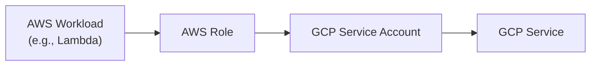

# GCP OIDC AWS Module

This module creates a GCP Workload Identity Federation to allow AWS workloads to authenticate to GCP via a GCP Service Account, without storing service account keys.


## How it works

1. AWS workloads get temporary credentials from AWS STS
2. These credentials are used to request a GCP access token via Workload Identity Federation
3. The AWS workload can then access GCP services as the configured service account




## Usage

### Terraform

```hcl
module "gcp_oidc_aws" {
  source = "./gcp-oidc-aws"

  project_id     = ...
  aws_account_id = ...

  sa_name         = ...
  sa_display_name = ...
  sa_roles = [
  ]

  aws_roles = [
    module.sample_lambda.lambda_role_name
  ]

  wi_pool_id           = ...
  wi_pool_display_name = ...

  wi_pool_provider_id           = ...
  wi_pool_provider_display_name = ...
}
```

The following APIs are required on the GCP project:

- `iamcredentials.googleapis.com`
- `sts.googleapis.com`


### Lambda Example

In your Lambda function, use this Python code:

```python
from google.auth import aws
from google.auth.transport.requests import Request

credentials = aws.Credentials(
    audience=audience,
    subject_token_type="urn:ietf:params:aws:token-type:aws4_request",
    token_url="https://sts.googleapis.com/v1/token",
    service_account_impersonation_url=f"https://iamcredentials.googleapis.com/v1/projects/-/serviceAccounts/{service_account_email}:generateAccessToken",
    credential_source={
        "environment_id": "aws1",
        "regional_cred_verification_url": "https://sts.{region}.amazonaws.com?Action=GetCallerIdentity&Version=2011-06-15",
        "url": "http://169.254.169.254/latest/meta-data/iam/security-credentials",
    },
    scopes=["..."],
)

# Refresh the credentials to get an access token
request = Request()
credentials.refresh(request)
```

Python libraries required by the Lambda function:

- `google-auth==2.35.0`
- `google-auth-httplib2==0.2.0`
